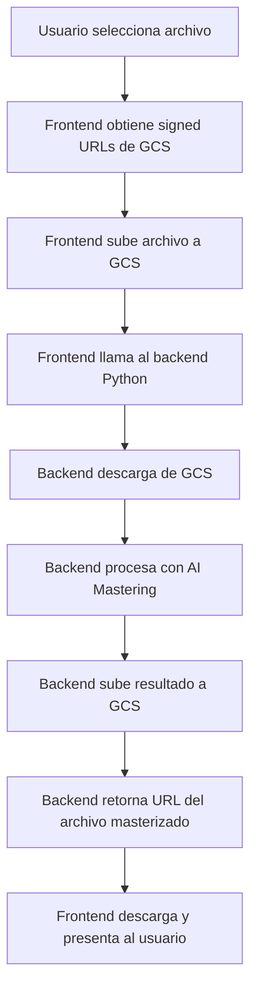

# Configuración del Backend Python para AI Mastering

## Variables de Entorno Requeridas

Para que la funcionalidad de AI Mastering funcione correctamente, necesitas configurar la siguiente variable de entorno:

### VITE_PYTHON_BACKEND_URL

Esta variable apunta al backend Python que procesa el audio mastering.

**Configuración:**

1. **Si usas el backend de Spectrum existente:**
   ```bash
   VITE_PYTHON_BACKEND_URL=https://spectrum-backend-857351913435.us-central1.run.app
   ```

2. **Si despliegas tu propio backend Python:**
   - Despliega el backend Python en Google Cloud Run o tu servicio preferido
   - Obtén la URL del servicio deployado
   - Configura la variable:
   ```bash
   VITE_PYTHON_BACKEND_URL=https://tu-backend-url.run.app
   ```

## ⚠️ IMPORTANTE: Configuración en Lovable

**El archivo `.env` es de solo lectura en Lovable y se gestiona automáticamente.**

Para agregar la variable `VITE_PYTHON_BACKEND_URL`:

### Opción 1: Usando el archivo de configuración del proyecto
Lovable puede permitir configurar variables públicas (VITE_*) a través de la configuración del proyecto.

### Opción 2: Hardcodear temporalmente (solo para pruebas)
Edita el archivo `src/hooks/useAIMastering.ts` y reemplaza:
```typescript
const backendUrl = import.meta.env.VITE_PYTHON_BACKEND_URL;
```

Por:
```typescript
const backendUrl = 'https://spectrum-backend-857351913435.us-central1.run.app';
```

**NOTA:** Esta es una solución temporal solo para pruebas. Para producción, debes configurar la variable de entorno correctamente.

---

## Backend Python Endpoints Requeridos

El backend Python debe exponer el siguiente endpoint:

### POST `/api/master-audio`

**Request Body:**
```json
{
  "inputUrl": "https://storage.googleapis.com/bucket/path/to/file.wav",
  "fileName": "audio-uploads/user-id/timestamp-file.wav",
  "settings": {
    "targetLoudness": -14,
    "compressionRatio": 4,
    "eqProfile": "neutral",
    "stereoWidth": 100
  }
}
```

**Response:**
```json
{
  "success": true,
  "masteredUrl": "https://storage.googleapis.com/bucket/mastered/file.wav",
  "jobId": "uuid-job-id",
  "processingTime": 45.3
}
```

**Settings Options:**
- `targetLoudness`: number (-20 to -8 LUFS, default: -14)
- `compressionRatio`: number (1 to 10, default: 4)
- `eqProfile`: "neutral" | "bright" | "warm" | "bass-boost" (default: "neutral")
- `stereoWidth`: number (50 to 150%, default: 100)

---

## Flujo de Procesamiento



---

## Testing

### 1. Verificar que GCS esté configurado
```bash
# Verificar que los secrets de Google Cloud Storage estén configurados
# En Lovable Cloud dashboard
```

### 2. Probar el flujo completo
1. Sube un archivo de audio en la pestaña "AI Mastering"
2. Haz clic en "Master My Track"
3. Observa el progress bar (0-100%)
4. El archivo masterizado se descargará automáticamente

### 3. Logs para debugging
Revisa los logs en:
- Console del navegador
- Lovable Cloud Edge Function logs (generate-upload-url)
- Backend Python logs

---

## Troubleshooting

### Error: "VITE_PYTHON_BACKEND_URL is not configured"
**Solución:** Configura la variable de entorno como se indica arriba.

### Error: "Failed to upload to cloud storage"
**Solución:** Verifica que los secrets de Google Cloud Storage estén correctamente configurados.

### Error: "Mastering failed"
**Solución:** 
1. Verifica que el backend Python esté running
2. Revisa los logs del backend Python
3. Confirma que el backend tenga acceso a Google Cloud Storage

### El archivo no se descarga
**Solución:** Verifica que el navegador no esté bloqueando descargas automáticas.

---

## Next Steps

1. ✅ Hook `useAIMastering` creado
2. ✅ Integración en `AIMasteringTab` completa
3. ✅ Progress bar y UI implementados
4. ⏳ Configurar `VITE_PYTHON_BACKEND_URL`
5. ⏳ Desplegar/configurar backend Python
6. ⏳ Probar flujo end-to-end

---

## Backend Python de Referencia

Si necesitas implementar el backend Python desde cero, aquí está la estructura básica:

```python
from flask import Flask, request, jsonify
from google.cloud import storage
import tempfile
import os

app = Flask(__name__)

@app.route('/api/master-audio', methods=['POST'])
def master_audio():
    data = request.json
    input_url = data.get('inputUrl')
    file_name = data.get('fileName')
    settings = data.get('settings', {})
    
    # 1. Download from GCS
    temp_input = download_from_gcs(input_url)
    
    # 2. Process with AI mastering
    temp_output = process_audio(
        temp_input,
        target_loudness=settings.get('targetLoudness', -14),
        compression_ratio=settings.get('compressionRatio', 4),
        eq_profile=settings.get('eqProfile', 'neutral'),
        stereo_width=settings.get('stereoWidth', 100)
    )
    
    # 3. Upload mastered file to GCS
    mastered_url = upload_to_gcs(temp_output, f"mastered/{file_name}")
    
    # 4. Return result
    return jsonify({
        'success': True,
        'masteredUrl': mastered_url,
        'jobId': str(uuid.uuid4()),
        'processingTime': 45.3
    })

if __name__ == '__main__':
    app.run(host='0.0.0.0', port=8080)
```

Para más detalles sobre el backend Python, consulta `MATCHERING_BACKEND_INTEGRATION_GUIDE.md`.
