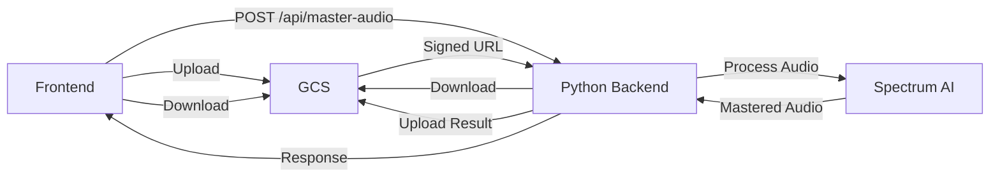

# Python Backend Setup for AI Mastering

This guide explains how to set up and deploy the Python backend for the AI Mastering feature.

## Overview

The Python backend handles the actual audio mastering process using Spectrum AI libraries. It:
1. Downloads audio files from Google Cloud Storage
2. Processes them using Spectrum's mastering algorithms
3. Uploads the mastered result back to GCS
4. Returns a signed URL for the frontend to download

## Environment Variables

Your backend needs these environment variables:

```bash
# Google Cloud Storage Configuration
GOOGLE_CLOUD_PROJECT_ID=total-acumen-473702-j1
GOOGLE_CLOUD_BUCKET_NAME=spectrum-mastering-files-857351913435
GOOGLE_APPLICATION_CREDENTIALS_JSON=<your-service-account-json>

# API Security (optional)
SPECTRUM_BACKEND_API_TOKEN=<your-secret-token>

# CORS Configuration
ALLOWED_ORIGINS=https://lyymcpiujrnlwsbyrseh.lovable.app,http://localhost:8080
```

### Setting Environment Variables

**For existing backend:**
If you already have a backend running, configure the `VITE_PYTHON_BACKEND_URL` environment variable:

1. The backend URL should point to your deployed service (e.g., Cloud Run URL)
2. Example: `https://spectrum-backend-857351913435.us-central1.run.app`

**Note:** The `.env` file is read-only and managed automatically by the Lovable platform. To configure this variable:
- Go to your project settings
- Navigate to environment variables section
- Add `VITE_PYTHON_BACKEND_URL` with your backend URL

## API Endpoint

### POST /api/master-audio

This endpoint receives audio mastering requests from the frontend.

**Request Body:**
```json
{
  "inputUrl": "https://storage.googleapis.com/...",
  "fileName": "audio-uploads/user-id/timestamp-filename.mp3",
  "settings": {
    "targetLoudness": -14,
    "compressionRatio": 4,
    "eqProfile": "neutral",
    "stereoWidth": 100
  }
}
```

**Success Response (200 OK):**
```json
{
  "success": true,
  "masteredUrl": "https://storage.googleapis.com/...",
  "jobId": "unique-job-id",
  "processingTime": 12.5
}
```

**Error Response (500):**
```json
{
  "success": false,
  "error": "Error message here"
}
```

### Settings Parameters

| Parameter | Type | Range | Default | Description |
|-----------|------|-------|---------|-------------|
| targetLoudness | number | -20 to -10 | -14 | Target LUFS level |
| compressionRatio | number | 1 to 10 | 4 | Compression ratio |
| eqProfile | string | neutral, bright, warm, bass-boost | neutral | EQ curve preset |
| stereoWidth | number | 0 to 200 | 100 | Stereo width percentage |

## Processing Workflow



## Testing

### 1. Test Google Cloud Storage Configuration

```bash
# Verify bucket exists and is accessible
gsutil ls gs://spectrum-mastering-files-857351913435

# Test upload
echo "test" > test.txt
gsutil cp test.txt gs://spectrum-mastering-files-857351913435/test.txt
gsutil rm gs://spectrum-mastering-files-857351913435/test.txt
```

### 2. Test Full Workflow

1. Go to your app's "AI Mastering" tab
2. Click "Test All" in the setup checker
3. Upload a test audio file
4. Monitor the processing stages

Expected behavior:
- ✅ File uploads to GCS
- ✅ Backend processes the audio
- ✅ Mastered file downloads successfully

## Troubleshooting

### Error: "VITE_PYTHON_BACKEND_URL is not configured"

**Solution:**
1. Configure the environment variable in your project settings
2. Or deploy the Python backend and set the URL

### Error: "Failed to upload to cloud storage"

**Solutions:**
1. Verify GCS bucket name is correct: `spectrum-mastering-files-857351913435`
2. Check service account has `Storage Object Admin` permission
3. Verify CORS is configured on the bucket

### Error: "Mastering failed: 404" or "Mastering failed: 500"

**Solutions:**
1. Check if backend is deployed and accessible
2. Verify backend logs for errors
3. Ensure all environment variables are set correctly
4. Check if Python dependencies are installed

### Testing Mode Activated

If you see "Testing Mode" messages, the backend is not responding. This is expected if:
- Backend is not deployed yet
- Backend URL is incorrect
- Backend is experiencing errors

The app will simulate processing to let you continue UI development.

---

## Reference: Python Backend Implementation

Below is a complete Python backend implementation using Flask and Google Cloud Storage.

### File: `main.py`

```python
import os
import json
import time
import uuid
from flask import Flask, request, jsonify
from flask_cors import CORS
from google.cloud import storage
from google.oauth2 import service_account
import tempfile

app = Flask(__name__)

# Configure CORS
allowed_origins = os.environ.get('ALLOWED_ORIGINS', '*').split(',')
CORS(app, origins=allowed_origins)

# Load Google Cloud credentials
project_id = os.environ.get('GOOGLE_CLOUD_PROJECT_ID')
bucket_name = os.environ.get('GOOGLE_CLOUD_BUCKET_NAME')
credentials_json = os.environ.get('GOOGLE_APPLICATION_CREDENTIALS_JSON')

if not all([project_id, bucket_name, credentials_json]):
    raise ValueError("Missing required environment variables")

credentials_dict = json.loads(credentials_json)
credentials = service_account.Credentials.from_service_account_info(credentials_dict)
storage_client = storage.Client(project=project_id, credentials=credentials)

@app.route('/health', methods=['GET'])
def health_check():
    """Health check endpoint for Cloud Run"""
    return jsonify({"status": "healthy", "service": "spectrum-mastering-backend"}), 200

@app.route('/api/master-audio', methods=['POST', 'OPTIONS'])
def master_audio():
    """Main endpoint for audio mastering"""
    
    # Handle CORS preflight
    if request.method == 'OPTIONS':
        return '', 204
    
    try:
        data = request.json
        input_url = data.get('inputUrl')
        file_name = data.get('fileName')
        settings = data.get('settings', {})
        
        if not input_url or not file_name:
            return jsonify({
                'success': False,
                'error': 'Missing required parameters: inputUrl and fileName'
            }), 400
        
        print(f"🎵 Starting mastering job for: {file_name}")
        print(f"⚙️ Settings: {settings}")
        
        start_time = time.time()
        job_id = str(uuid.uuid4())
        
        # Step 1: Download from GCS
        print(f"📥 Downloading from GCS...")
        input_blob = download_from_gcs(file_name)
        
        # Step 2: Process audio with Spectrum
        print(f"🎚️ Processing audio...")
        mastered_audio = process_audio(input_blob, settings)
        
        # Step 3: Upload to GCS
        print(f"📤 Uploading mastered audio to GCS...")
        mastered_file_name = file_name.replace('.', '_mastered.')
        mastered_url = upload_to_gcs(mastered_audio, mastered_file_name)
        
        processing_time = time.time() - start_time
        print(f"✅ Mastering completed in {processing_time:.2f}s")
        
        return jsonify({
            'success': True,
            'masteredUrl': mastered_url,
            'jobId': job_id,
            'processingTime': processing_time
        }), 200
        
    except Exception as e:
        print(f"❌ Error in master_audio: {str(e)}")
        return jsonify({
            'success': False,
            'error': str(e)
        }), 500

def download_from_gcs(file_name):
    """Download a file from Google Cloud Storage"""
    try:
        bucket = storage_client.bucket(bucket_name)
        blob = bucket.blob(file_name)
        
        # Download to temporary file
        temp_file = tempfile.NamedTemporaryFile(delete=False, suffix=os.path.splitext(file_name)[1])
        blob.download_to_filename(temp_file.name)
        
        print(f"✅ Downloaded {file_name} from GCS")
        return temp_file.name
        
    except Exception as e:
        print(f"❌ Failed to download from GCS: {str(e)}")
        raise

def process_audio(input_file_path, settings):
    """
    Process audio using Spectrum mastering algorithms.
    
    This is where you integrate your Spectrum audio processing library.
    Replace this implementation with actual Spectrum API calls.
    """
    try:
        # TODO: Integrate with Spectrum mastering library
        # Example pseudo-code:
        # 
        # from spectrum import Mastering
        # 
        # mastering = Mastering()
        # mastering.set_loudness(settings.get('targetLoudness', -14))
        # mastering.set_compression(settings.get('compressionRatio', 4))
        # mastering.set_eq_profile(settings.get('eqProfile', 'neutral'))
        # mastering.set_stereo_width(settings.get('stereoWidth', 100))
        # 
        # output_path = mastering.process(input_file_path)
        # return output_path
        
        # For now, this is a placeholder that returns the input file
        print(f"⚠️ WARNING: Using placeholder audio processing")
        print(f"⚙️ Settings applied: {settings}")
        
        # In production, replace this with actual Spectrum processing
        return input_file_path
        
    except Exception as e:
        print(f"❌ Failed to process audio: {str(e)}")
        raise

def upload_to_gcs(file_path, destination_name):
    """Upload a file to Google Cloud Storage and return signed URL"""
    try:
        bucket = storage_client.bucket(bucket_name)
        blob = bucket.blob(destination_name)
        
        # Upload file
        blob.upload_from_filename(file_path)
        print(f"✅ Uploaded {destination_name} to GCS")
        
        # Generate signed URL (valid for 24 hours)
        url = blob.generate_signed_url(
            version='v4',
            expiration=86400,  # 24 hours
            method='GET'
        )
        
        # Clean up temporary file
        if os.path.exists(file_path):
            os.unlink(file_path)
        
        return url
        
    except Exception as e:
        print(f"❌ Failed to upload to GCS: {str(e)}")
        raise

if __name__ == '__main__':
    port = int(os.environ.get('PORT', 8080))
    app.run(host='0.0.0.0', port=port)
```

### File: `requirements.txt`

```txt
flask==3.0.0
flask-cors==4.0.0
google-cloud-storage==2.14.0
google-auth==2.27.0
# Add your Spectrum library dependencies here
```

### File: `Dockerfile`

```dockerfile
FROM python:3.11-slim

WORKDIR /app

# Install system dependencies
RUN apt-get update && apt-get install -y \
    gcc \
    g++ \
    ffmpeg \
    && rm -rf /var/lib/apt/lists/*

# Copy requirements and install Python dependencies
COPY requirements.txt .
RUN pip install --no-cache-dir -r requirements.txt

# Copy application code
COPY . .

# Set environment variables
ENV PORT=8080
ENV PYTHONUNBUFFERED=1

# Expose port
EXPOSE 8080

# Run the application
CMD ["python", "main.py"]
```

### File: `.gcloudignore`

```
.git
.gitignore
__pycache__/
*.pyc
*.pyo
*.pyd
.Python
env/
venv/
*.env
.env.local
node_modules/
```

## Deployment to Google Cloud Run

### Prerequisites

1. Install Google Cloud SDK: https://cloud.google.com/sdk/docs/install
2. Authenticate: `gcloud auth login`
3. Set project: `gcloud config set project total-acumen-473702-j1`

### Deploy Steps

1. **Build and deploy:**

```bash
# Navigate to your backend directory
cd /path/to/your/backend

# Deploy to Cloud Run
gcloud run deploy spectrum-mastering-backend \
  --source . \
  --platform managed \
  --region us-central1 \
  --allow-unauthenticated \
  --set-env-vars GOOGLE_CLOUD_PROJECT_ID=total-acumen-473702-j1,GOOGLE_CLOUD_BUCKET_NAME=spectrum-mastering-files-857351913435 \
  --set-secrets GOOGLE_APPLICATION_CREDENTIALS_JSON=GOOGLE_APPLICATION_CREDENTIALS_JSON:latest \
  --memory 2Gi \
  --cpu 2 \
  --timeout 300 \
  --max-instances 10
```

2. **Set CORS origins:**

```bash
# After deployment, update CORS origins
gcloud run services update spectrum-mastering-backend \
  --region us-central1 \
  --update-env-vars ALLOWED_ORIGINS=https://lyymcpiujrnlwsbyrseh.lovable.app,http://localhost:8080
```

3. **Get the deployment URL:**

```bash
gcloud run services describe spectrum-mastering-backend \
  --region us-central1 \
  --format 'value(status.url)'
```

4. **Update your frontend:**

Add the Cloud Run URL to your environment variables:
- Variable name: `VITE_PYTHON_BACKEND_URL`
- Value: Your Cloud Run URL (e.g., `https://spectrum-mastering-backend-857351913435.us-central1.run.app`)

### Test Deployment

```bash
# Test health endpoint
curl https://your-cloud-run-url.run.app/health

# Test mastering endpoint
curl -X POST https://your-cloud-run-url.run.app/api/master-audio \
  -H "Content-Type: application/json" \
  -d '{
    "inputUrl": "https://storage.googleapis.com/...",
    "fileName": "test-audio.mp3",
    "settings": {
      "targetLoudness": -14,
      "compressionRatio": 4,
      "eqProfile": "neutral",
      "stereoWidth": 100
    }
  }'
```

### Monitor Logs

```bash
# View real-time logs
gcloud run services logs tail spectrum-mastering-backend --region us-central1

# View recent logs
gcloud run services logs read spectrum-mastering-backend --region us-central1 --limit 100
```

## Cost Optimization

**Cloud Run Pricing:**
- Free tier: 2 million requests/month
- $0.00002400 per request after free tier
- CPU: $0.00002400 per vCPU-second
- Memory: $0.00000250 per GiB-second

**Optimization Tips:**
1. Use `--min-instances 0` to scale to zero when idle
2. Set appropriate `--max-instances` to control costs
3. Set `--timeout` to prevent long-running requests
4. Monitor usage in Google Cloud Console

## Security Best Practices

1. **API Authentication:** Consider adding API token authentication
2. **Rate Limiting:** Implement rate limiting to prevent abuse
3. **Input Validation:** Validate all input parameters
4. **CORS:** Restrict allowed origins to your domains only
5. **Secrets:** Use Google Secret Manager for sensitive data
6. **Monitoring:** Set up Cloud Monitoring alerts

## Next Steps

1. Replace the placeholder `process_audio()` function with actual Spectrum mastering code
2. Add proper error handling and logging
3. Implement API authentication if needed
4. Set up monitoring and alerting
5. Test with various audio files and settings
6. Update frontend `VITE_PYTHON_BACKEND_URL` with your Cloud Run URL

---

**Need help?** Check the troubleshooting section or review the logs for specific errors.
